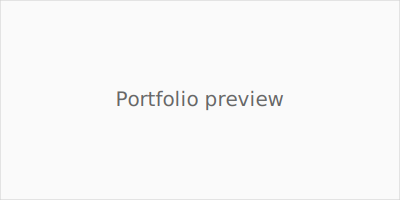

# portfolio

This project is a simple React portfolio scaffolded with Webpack. Follow the
steps below to start the development server:

1. Install dependencies with `npm install`.
2. Start the dev server with `npm start`.

The application will open in your browser at [http://localhost:3000](http://localhost:3000).

## Overview

The portfolio is a single page React application with the following features:

* **Hero** landing section.
* **About** section with a short biography.
* **Skills** display with progress bars.
* **Projects** grid showcasing example work.
* **Contact** form and footer.

Horizontal scrolling connects each section with a progress bar and dot navigation.

### Folder layout

```
src/            Source files
  components/   Reusable React components
  pages/        Top level pages (App.jsx)
  data/         Static data such as project lists
  styles/       Global CSS
public/         Static HTML template and assets
dist/           Production build output
```

## Production build

To create a production build, run `npm run build`. The optimized bundle
(`bundle.js`) will be generated in the `dist` folder. Copy `public/index.html`
alongside the output if you want to serve the build from a static file server.

## Preview

Below is a placeholder preview of the application.


